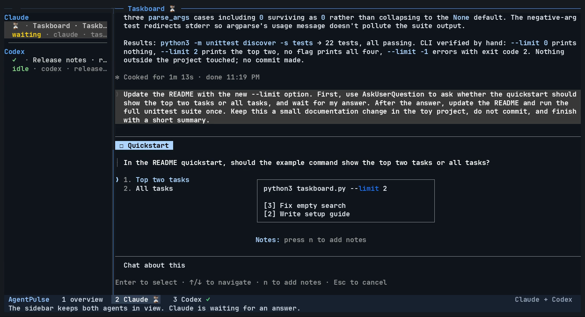

# AgentPulse for tmux

[](https://github.com/jerriclynsjohn/tmux-agent-pulse/actions/workflows/ci.yml)
[](LICENSE)

AgentPulse shows which Claude Code and Codex CLI conversations are working, waiting for you, or idle in tmux.
Add indicators to your window list and pane borders, or use the optional popup picker and sidebar.

The plugin tracks the process that owns each conversation.
A live agent without a matching hook record appears as unknown.
Internal child agents remain part of their parent pane.

The plugin started as a way to keep track of Claude Code and Codex during daily work across several tmux panes.
It is an early preview under the [MIT license](LICENSE). There is no tagged release yet.

## Demo

[](docs/assets/agentpulse-demo.mp4)

[Watch the demo](docs/assets/agentpulse-demo.mp4) (68 seconds, silent, 2.3 MB).

The recording uses real Claude Code and Codex sessions in two sample projects.
It shows a question and permission prompt, work resuming after a response, and navigation with the popup and sidebar.
Captions are included, and pauses are shortened.

## Requirements

- Python 3.10 or newer, with its standard library
- tmux and Bash on macOS or Linux
- Claude Code or Codex CLI with lifecycle hooks
- `fzf` for the optional popup

The local test environment uses tmux 3.6a and Codex CLI 0.153.4.
The repository includes macOS/Linux CI.
See the [latest CI results](https://github.com/jerriclynsjohn/tmux-agent-pulse/actions).
See [compatibility and test coverage](docs/compatibility.md).

## Install with TPM

Add the declaration before TPM initialization in your tmux configuration:

```tmux
set -g @plugin 'jerriclynsjohn/tmux-agent-pulse'

# Keep your existing TPM initialization at the end of the configuration.
run '~/.tmux/plugins/tpm/tpm'
```

If your TPM initialization path differs, use that path in the example.
Reload your tmux configuration.
Press `prefix + I` to install the plugin.
Then install the agent hooks as described below.

With TPM's default directory, run the remaining commands from `~/.tmux/plugins/tmux-agent-pulse`.
For a custom plugin directory, use that checkout instead.

## Load a local checkout

Run these commands from the repository directory, inside tmux:

```sh
./agent-pulse.tmux
./bin/tmux-agent-pulse doctor
```

The entry point starts one ticker for the current tmux server.
The ticker publishes status for your existing theme to display.
Loading the plugin creates no sidebar panes, changes no theme, and assigns no keys by default.
Repeated loading reuses the ticker.

To display status in your window list, add this example to your tmux configuration:

```tmux
set -g window-status-format '#I:#W#{@agent-pulse-window-icon}'
set -g window-status-current-format '#I:#W#{@agent-pulse-window-icon}'
```

These example lines replace those two format strings.
For an existing theme, add `#{@agent-pulse-window-icon}` to that theme's window format instead.

## Install the agent hooks

Hooks are commands that the agent runs at lifecycle events.
The plugin needs these events to distinguish working, waiting, idle, and cancelled states.

1. Preview the changes for your provider:

   ```sh
   ./bin/tmux-agent-pulse install --provider claude
   # Or: --provider codex / --provider both
   ```

2. Apply the displayed changes:

   ```sh
   ./bin/tmux-agent-pulse install --provider claude --apply
   ```

3. For Codex, review and trust the installed hooks through `/hooks` before use.
4. Start a new agent conversation in tmux.

Installation preserves unrelated hook definitions and saves backups before changes.
It records its own definitions in an installation manifest.
It does not configure hooks when TPM loads the plugin.

The installer uses `CLAUDE_CONFIG_DIR` and `CODEX_HOME` when present.
Explicit `--claude-home` and `--codex-home` arguments take precedence.
See [installation and removal](docs/installation.md) for custom paths and Codex trust review.

## Optional views

Run the popup or sidebar from inside tmux:

```sh
./bin/tmux-agent-pulse popup
./bin/tmux-agent-pulse sidebar on
./bin/tmux-agent-pulse sidebar off
```

To assign keys, place these lines before the plugin loads:

```tmux
set -g @agent-pulse-popup-key 'a'
set -g @agent-pulse-sidebar-key 'A'
set -g @agent-pulse-sidebar-width 24
```

These keys use the tmux prefix table.
The plugin preserves a key that another plugin already owns and reports the conflict.
See [configuration](docs/configuration.md) for status fields, colors, and plain ASCII symbols.

## TPM entry point

TPM runs the executable `agent-pulse.tmux` file at the repository root.
The entry point locates the code relative to itself, including checkout paths with spaces.
It does not depend on a dotfiles checkout or either provider's configuration directory.
The tested TPM discovery script requires a plugin installation path without spaces.
The direct entry point also supports checkout paths with spaces.

The [minimal example](examples/minimal.tmux.conf) includes a TPM declaration and status formats.
TPM's [authoring guide](https://github.com/tmux-plugins/tpm/blob/master/docs/how_to_create_plugin.md)
describes entry points and Git remotes.

## Status meanings

| State | Meaning |
| --- | --- |
| `waiting` | A question or permission request needs a response |
| `working` | The agent has an active turn |
| `cancelled` | An explicit interruption or cancellation occurred |
| `idle` | A session started or a turn finished |
| `unknown` | A live agent has no matching status record |

Window indicators use that priority order across their panes.
An exited agent loses its indicator.
An idle indicator describes the conversation state, not the completeness of the user's project.

## Diagnose or remove

```sh
./bin/tmux-agent-pulse doctor --json
./bin/tmux-agent-pulse uninstall --provider both
./bin/tmux-agent-pulse uninstall --provider both --apply
./bin/tmux-agent-pulse unload
```

Run uninstall before removing the checkout through TPM.
TPM removes plugin files, but it does not remove hooks from provider configuration.
Uninstall removes only unchanged hook definitions recorded by this installation.
Unload stops this plugin's ticker and removes its owned tmux integration.

Status records and bounded diagnostic logs contain lifecycle metadata, without prompts, tool arguments, or responses.
See [troubleshooting](docs/troubleshooting.md) for unknown status and the data paths.

## Development

```sh
AGENT_PULSE_REAL_TMUX_TEST=1 PYTHONDONTWRITEBYTECODE=1 python3 -m unittest discover -s tests
PYTHONDONTWRITEBYTECODE=1 python3 tests/tmux_status_smoke.py
```

The integration tests use private tmux servers and temporary agent processes.
They do not send model requests or operate existing tmux panes.
See [contribution guidance](CONTRIBUTING.md) and [release work](docs/roadmap.md).

## Community

- [Get help or report a bug](SUPPORT.md)
- [Contribute a change](CONTRIBUTING.md)
- [Report a security issue privately](SECURITY.md)
- [Code of conduct](CODE_OF_CONDUCT.md)
- [Changelog](CHANGELOG.md) and [release policy](docs/releasing.md)

## License

AgentPulse is available under the [MIT license](LICENSE).
The code of conduct retains its [Contributor Covenant attribution](CODE_OF_CONDUCT.md#attribution).
